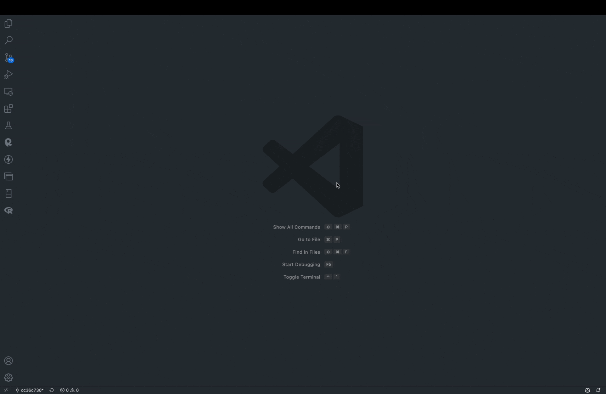

<div align=center>

# Hosting a (Cool!) Resume with Hugo on GitHub Pages
This guide was done on macOS, but steps on other operating systems will vary when it comes to installation.

This README will help you create a resume hosted online on GitHub Pages using Hugo. Hugo is a static site generator. All you need to know is basic Markdown skills, which are available in the More Resources section. This README is inspired by Andrew Etter's Modern Technical Writing guide to writing an instruction set, and should be able to help you create a resume that has a cool look to it, in a command line theme. Using a light markup language such as Markdown is much easier to manipulate than writing plain HTML or using a word processor.

</div>

<hr>

### Prerequisites
1. A computer running macOS Ventura
2. A resume formatted in Markdown
3. [Visual Studio Code](https://code.visualstudio.com/); *Make sure you download the right version for your CPU architecture.*
4. Git, Homebrew (for macOS), Hugo; *This README will cover how to download these on your system.*
5. XCode Command Line Tools
6. Getting comfortable on the command line interface (terminal, command prompt)
7. An understanding in Markdown
8. [A GitHub account](https://github.com)

### Instructions

#### Installing prerequisites

1. Download Homebrew by entering this command in your Terminal:
```bash
/bin/bash -c "$(curl -fsSL https://raw.githubusercontent.com/Homebrew/install/HEAD/install.sh)"
```

* If you're on Apple Silicon (M1, M2), make sure to enter this command as an extra step to ensure Homebrew is set up properly in your environment.
```bash
echo 'eval "$(/opt/homebrew/bin/brew shellenv)"' >> ~/.zprofile
eval "$(/opt/homebrew/bin/brew shellenv)"
```

* This sets up your PATH, or the ability to execute Homebrew from any directory in the terminal. For the remainder of the steps, Homebrew handles the setup to PATH automatically for you.

2. Verify Homebrew is installed with this command.
```bash
brew -v
```
3. Once complete, install Git using Homebrew
```bash
brew install git
```
4. After completing the installation, verify Git is installed
```bash
git -v
```
5. Finally, install Hugo on your system using Homebrew.
```bash
brew install hugo
```
6. Verify you have installed Hugo by entering the following command:
```bash
hugo version
```
> If at any point these steps fail to work, please check if brew is installed correctly on your system. 

#### Setting up your work environment

7. Create a new folder to begin creating your new site hosting your resume. You can also use the terminal for this task. We will be using the folder name `Website` however feel free to change the name to whatever you like.
```bash
mkdir Website
cd Website
```

* We will be using the hugo-shell-theme provided by [Yukuro](https://github.com/Yukuro/hugo-theme-shell) in these instructions, however you could choose whatever theme you like [here](https://themes.gohugo.io/)

* Here is how the theme will look like for you:


8. Create a new Hugo site inside the `Website` directory; we will be calling our website `Resume`
```bash
hugo new site Resume
cd Resume
```

9. Open this folder in Visual Studio Code using the terminal.
```bash
code .
```
* If this command fails to work, you might not have Visual Studio Code in your PATH. In that case:
    * Launch Visual Studio Code.
    * Press `Cmd+Shift+P` and type `shell command`.
    * Click the `Shell Command: Install 'code' command in PATH`
    * Close out of Visual Studio Code using `Cmd+Q`

#### Creating the GitHub Repository
10. Once you have done that, it is important to back everything up in a Github repository.

11. Head to [Github's homepage](https://github.com) and create a new repository with the following name: `[your Github username].github.io`
* 

12. Create a local repository with your changes.
```bash
git init
git add .
git commit -m "Our first commit"
git branch -M main
git remote add origin https://github.com/[your username]/[your username].github.io.git
git push -u origin main
```
* At this point, you might be asked to login with GitHub in your terminal. Go ahead and do that.

#### Installing our theme
13. Now let us add our theme to the website.
```bash
git submodule add https://github.com/Yukuro/hugo-theme-shell.git themes/hugo-theme-shell
echo "theme='hugo-theme-shell'" >> config.toml
```
* The last line edits our config file to use our theme.

14. To be able to edit our theme's configuration, we have to remove our submodule.
```bash
git rm --cached themes/hugo-theme-shell
git rm .gitmodules
rm -rf themes/hugo-theme-shell/.git
git add themes/hugo-theme-shell
git commit -m "Our second commit, we now have created a theme for our website"
```

#### Editing our theme
15. Inside Visual Studio Code, on the side click the Explorer tab and open up the path `themes/hugo-theme-shell/config/_default` then open the `config.toml` by double-clicking on it.
* 

16. Erase what is built in and copy paste the following lines in your `config.toml`. Make sure you change what ever is in square brackets and capital letters to the instructions written.
```toml
baseURL = [ENTER YOUR GITHUB REPOSITORY NAME HERE IN DOUBLE QUOTES]
title = "Shell"
# author = "Yukuro"
ignoreErrors = ["error-remote-getjson"]

[Params]
  schema = [MAKE SURE THIS IS SET TO "ubuntu"]

  userName = [PUT YOUR USERNAME HERE YOU WOULD LIKE TO SHOW]
  pcName = [PUT YOUR PC NAME HERE]
  workDir = [PUT YOUR WORK DIRECTORY HERE, I CHOSE: "my_profile"]
  profile = [PUT YOUR TEXT FILE HERE, I CHOSE: "profile.txt"]

  ps1Delay = 0 
  stdoutDelay = 0 
  commandDelay = 50 

  titleDelay = 0 # title speed : "title" in front matter
  contentDelay = 0 # content speed : content in .md file


  description = """
  [WRITE YOUR DESCRIPTION IN BETWEEN THESE QUOTES]
  
  """

  [Params.Tree]
  use = true
  folderName = [CHANGE THIS TO A FOLDER NAME, I CHOSE: "my_resume"]
  files = [ 
    ["Resume", "posts/resume.md"] 
  ]

[module]
  [module.hugoVersion]
    extended = true
    min = "0.85.0"
```
#### Creating our Resume page
17. Create a new "post" or page by typing the following in your terminal:
```bash
hugo new posts/resume.md
```
* This change should now appear under the `content/posts` folder in Visual Studio Code.

18. Open the `resume.md` file and change the title to your choosing and the `draft=true` parameter to `false`

19. Launch the Hugo server by typing in the following in your terminal:
```bash
hugo server
```

#### Editing our Resume Page
20. Navigate to [localhost:1313](localhost:1313) on your web browser to see your new website. Your changes should be reflected and the resume.md page will be correctly loaded.

21. Now you can feel free to edit your resume in your `resume.md` file to your liking. Your changes will be reflected live on your browser.

#### Building your website
22. Once complete, build your website.
```bash
hugo
```
* If your server is still running, press `Ctrl+C` to quit the server. You can always start it again by `hugo server`

#### Deploying our website
23. Head over to your repository page on GitHub and click on Settings then Pages

24. Under the Build and Deployment section, change the source from `Deploy from a branch` to `GitHub Actions`.

25. Next, head to the Actions tab. Search for Hugo and click on Configure. At the top, click on Start Commit and click on Commit new file
* 

26. Now let us deploy our website.
```bash
git commit -m "Our final website"
git push -u origin main
```

#### Final Result
27. Wait a few minutes and your website will be ready to view at your repository name's URL!

Here is my final product.


### More Resources
1. [Andrew Etter's Modern Technical Writing](https://www.amazon.ca/Modern-Technical-Writing-Introduction-Documentation-ebook/dp/B01A2QL9SS)
2. [Markdown Tutorial](https://www.markdowntutorial.com/)
3. [My Final Website](https://hamdielzard.github.io)
4. [My GitHub repo](https://github.com/hamdielzard/hamdielzard.github.io)


### Authors and Acknowledgements
This repository is authored by Hamdi Elzard. Acknowledgements go out to the [Hugo development team](https://github.com/gohugoio/hugo), [Yukuro for the Shell theme template](https://github.com/Yukuro/hugo-theme-shell), and my group members at the University of Manitoba for class COMP 3040: Dane Wanke, Dirk Page, and Frieda Bi.

### FAQs
1. **Why use Markdown instead of a word editor like Microsoft Word?**
> Markdown is significantly lighter and easier to read for a computer and a human. It also has a very small learning curve and can be opened and viewed even without a Markdown viewer. Word files tend to be complicated to be understood by a computer, and usually require software like Microsoft Office. Another benefit is that it is far easier to modify on the go.

2. **Why is my resume not showing up?**
> Make sure that your `resume.md` file exists under `content/posts`. If you follow the right commands exactly, it should be placed right there. Also make sure that in the theme configuration under `themes/config/_default/config.toml` the resume link under the files variable is not misspelled. If you copy pasted my given config.toml this should not be affected.
